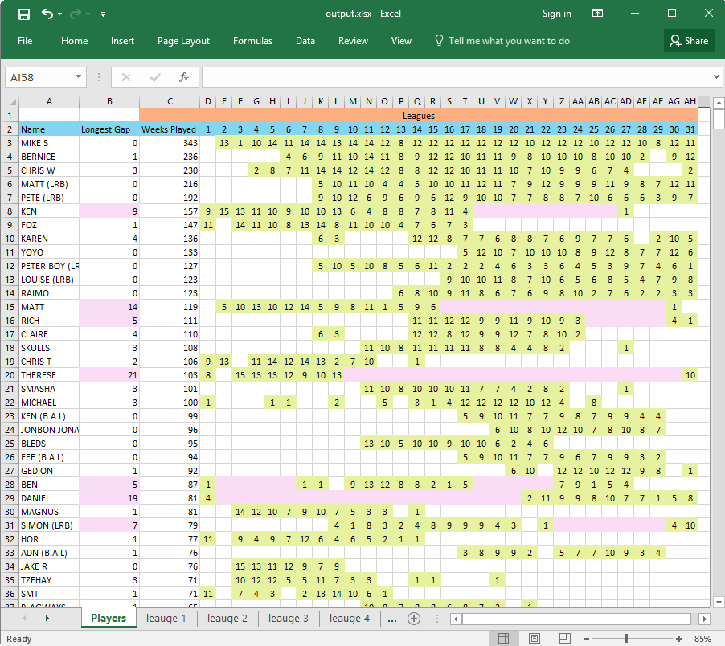

```
  _______         _____ _       _____  _                             .-.\ /    .-.
 |__   __|       |  __ (_)     |  __ \| |                            \ /|=|    \ /
    | | ___ _ __ | |__) | _ __ | |__) | | __ _ _   _  ___ _ __ ___   |=|   \   |=|
    | |/ _ \ '_ \|  ___/ | '_ \|  ___/| |/ _` | | | |/ _ \ '__/ __| /   \ ---./   \
    | |  __/ | | | |   | | | | | |    | | (_| | |_| |  __/ |  \__ \ |   / ..  \   |
    |_|\___|_| |_|_|   |_|_| |_|_|    |_|\__,_|\__, |\___|_|  |___/ |  |#  '   |  |
                                                __/ |                '._\     /_.'
                                               |___/                     '---'
```

TenPinPlayers is a small script designed to analyse excel workbooks containing past bowling league scores. 
It is to help find any name clashes and to help work out who's who. Some players may have had there names mispelt in the past
or bowled under a variation of their name, all these can be easily spotted to ensure everones data is correct linked to them.

The resulting sheet with contain...
### Master player sheet
The master player sheet showing every unique player name from the imported leagues. With each name is how many
times that name appeared in each league.
If there is a league that contains a week where that name appears twice (a clash) that league will be highligted in red.
Each player will have a count showing how many total weeks they played.
Also displayed is the longest time a player had off between leagues. To help analyse the data, if the player has had a break of more than
5 weeks, (number controlled via option) the player will be highlited pink and the gap will be highlgted. The reason behind this is that if
there is a large gap, it may actually be 2 seperate people. i.e "Matt" in league 4 and a "Matt" in league 26 - Most likely a different Matt. 
The pink highlight will help show these.

### League sheets
Each league that gets analysed will have its own sheet created. The data on these sheets will be of the same logic as the main sheet. The only
difference is that it will be in the weekly level for that league. The sheet will display all the players for that particular league and what weeks they bowled.

# Usage
```
python main.py "./league scores" "output" --leaguegapthreshold 5
```
```
python main.py FILESDIRECTORY OUTPUTFILENAME --leaguegapthreshold

  FILESDIRECTORY: Directory where the league files to be analysied are (xlsx files) 
  OUTPUTFILENAME: File to save results to. Excluding extension.

  --leaguegapthreshold: How long should a gap between a players leagues be before highlighting (Default: 5)
```

# Example output (Generated using data from league scores folder)


# Todo
- [ ] Unit tests